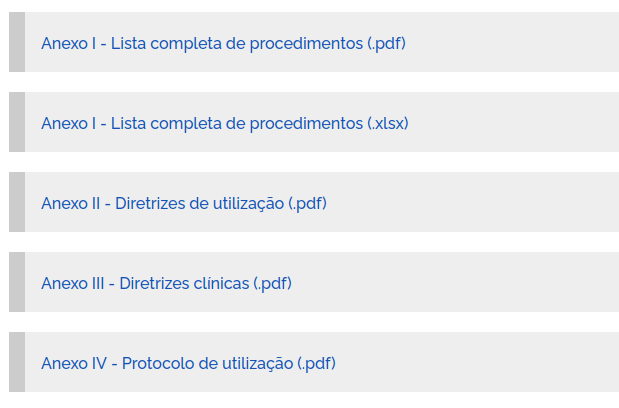
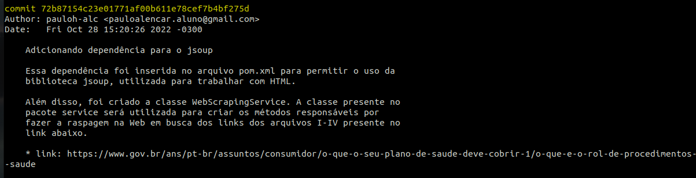
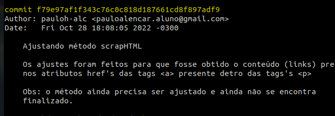
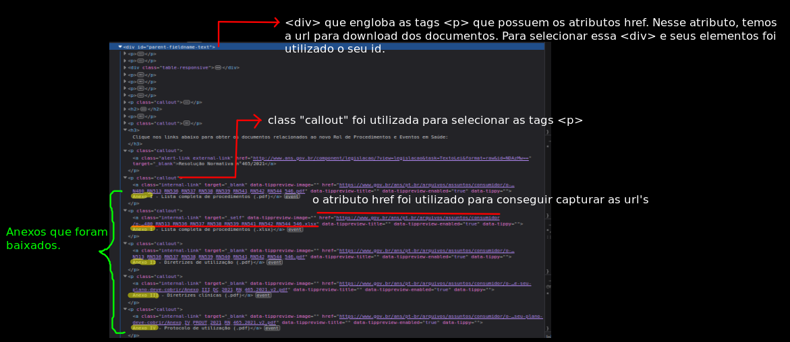
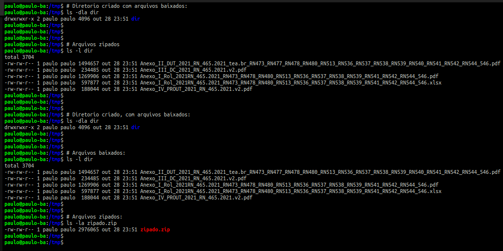
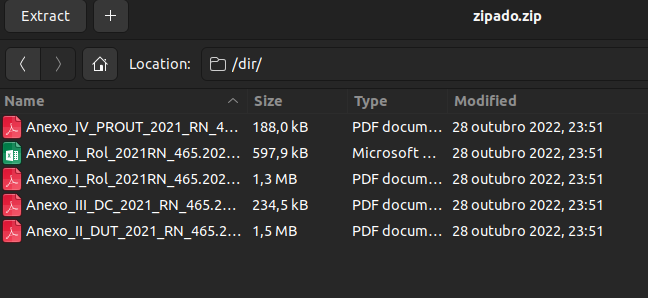

# WebScraping - com Java

- 1.1 Acessar o site: https://www.gov.br/ans/pt-br/assuntos/consumidor/o-que-o-seu-plano-de-saude-deve-cobrir-1/o-que-e-o-rol-de-procedimentos-e-evento-em-saude

- 1.2 Baixar os Anexos I ao Anexo IV

- 1.3 Agrupar os anexos em um mesmo arquivo compactado (ZIP, RAR, ...)

1. Clone este repositório:
```sh
git clone https://github.com/pauloh-alc/web-scraping-com-java.git 
```
## Sistema de Versão de Controle

- Git

Eu tentei fazer os commits deste projeto de uma maneira organizada. Com isso, apliquei algumas dicas, para uma melhor mensagem de commit.

Segue o modelo: [estilo-de-commit](https://commit.style/)

- Alguns screenshots de commits 




## Raspagem de dados na Web


## Resultados



